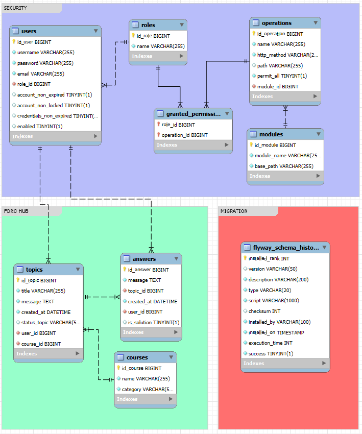

# 💬 FORO HUB

**Foro Hub** es una API REST que forma parte del backend de una plataforma de discusión y aprendizaje.

Este proyecto fue desarrollado como parte del **Challenge de Alura Latam - Oracle Next Education**.

La API incluye funcionalidades para la gestión de usuarios, roles, módulos, cursos, tópicos y respuestas, con autenticación basada en **JWT** y control de acceso basado en roles.

---

## 🚀 Tecnologías utilizadas

* **Java 23**
* **Spring Boot 3**
* **Spring Security**
* **JWT (JSON Web Tokens)**
* **Spring Data JPA**
* **MySQL** (por defecto)
* **H2** (para pruebas)
* **Flyway** (migraciones)
* **Swagger / OpenAPI 3**
* **Lombok**
* **Maven**

---

## ⚙️ Configuración del proyecto

### 1. Clonar el repositorio

```bash
git clone https://github.com/tu-usuario/foro-hub.git
cd foro-hub
```

---

### 2. Configurar la base de datos

El proyecto utiliza **MySQL** por defecto con el perfil `dev`.

Si deseas usar una base de datos personalizada o en la nube (como Supabase, Render, PlanetScale, etc.), debes modificar el archivo `src/main/resources/application-prod.properties`.

Ejemplo:

```properties
spring.profiles.active=prod
spring.datasource.url=jdbc:mysql://localhost:3306/foro_hub
spring.datasource.username=tu_usuario
spring.datasource.password=tu_password
```

> 💡 También puedes crear otros archivos de propiedades según tus entornos (`application-dev.properties`, `application-prod.properties`, etc.)

---

### 3. Configurar claves JWT (variables de entorno)

Para el funcionamiento del sistema JWT con firma y encriptación EC (Elliptic Curve), debes generar claves y agregarlas como variables de entorno.

1. Ejecuta el script `generateKeysES521.bat` (solo en Windows). Este generará 8 archivos (4 `.txt` y 4 `.pem`).

2. Crea un archivo `.env` en la raíz del proyecto y define las siguientes variables usando el contenido de los archivos `.txt` generados:

```env
JWT_SECRET_TOKEN_SIGNER_PRIVATE=<contenido de signer_ec_private_base64.txt>
JWT_SECRET_TOKEN_SIGNER_PUBLIC=<contenido de signer_ec_public_base64.txt>
JWT_SECRET_TOKEN_ENCRYPT_PRIVATE=<contenido de encrypt_ec_private_base64.txt>
JWT_SECRET_TOKEN_ENCRYPT_PUBLIC=<contenido de encrypt_ec_public_base64.txt>
```

> 🛠️ Si el script no funciona correctamente, asegúrete de tener **OpenSSL** instalado.
> 🔐 El proyecto incluye claves por defecto, pero **se recomienda generar nuevas si lo usarás para fines personales o productivos.**

---

## ▶️ Ejecución del proyecto

Una vez configurado todo:

```bash
mvn clean install
mvn spring-boot:run
```

La aplicación estará disponible en:

```
http://localhost:9095/api/v1
```

---

## 🔧 Pruebas

El proyecto incluye pruebas unitarias y de integración utilizando **JUnit** y base de datos **H2 en memoria**.

```bash
mvn test
```

---

## 🔍 Documentación Swagger

Puedes acceder a la documentación interactiva de la API generada con Swagger en:

```
http://localhost:9095/api/v1/documentation/swagger-ui/index.html
```

Desde ahí puedes probar los endpoints, revisar modelos y detalles de seguridad (JWT).

---

## 💡 Funcionalidades destacadas

* Registro y autenticación de usuarios
* Cambio de contraseña y deshabilitación de cuenta
* Gestión de roles y permisos
* CRUD para módulos, cursos, tópicos y respuestas
* Control de acceso por rol
* Paginación y ordenamiento de resultados
* Manejo centralizado de errores con `@RestControllerAdvice`

---

## 📜 Licencia

[MIT License](LICENSE)

## Diagrama de la base de datos

